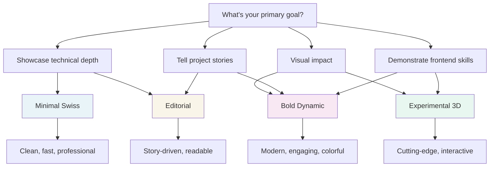

# Project Page Design Comparison

## Quick Reference Guide

### At a Glance

| Aspect | Minimal Swiss | Bold Dynamic | Editorial | Experimental 3D |
|--------|--------------|--------------|-----------|-----------------|
| **Complexity** | Low | Medium | Medium | High |
| **Visual Impact** | Subtle | High | Moderate | Very High |
| **Content Focus** | High | Medium | Very High | Low |
| **Implementation Time** | Fast | Moderate | Moderate | Long |
| **Performance** | Excellent | Good | Excellent | Challenging |
| **Maintenance** | Easy | Medium | Easy | Complex |
| **Accessibility** | Excellent | Good | Excellent | Needs Work |
| **Mobile Experience** | Great | Good | Excellent | Challenging |

### Design Personalities

**Minimal Swiss** = Apple, Linear, Vercel
- *"Less is more. Clean, precise, timeless."*
- Best for: Engineering projects, technical portfolios
- Vibe: Professional, mature, confident

**Bold Dynamic** = Stripe, Figma, Framer
- *"Energy and personality. Modern and vibrant."*
- Best for: Product design, creative work, UI/UX
- Vibe: Exciting, contemporary, engaging

**Editorial** = Medium, NYTimes, The Verge
- *"Story first. Deep, thoughtful, journalistic."*
- Best for: Case studies, research, detailed process
- Vibe: Authoritative, sophisticated, narrative-driven

**Experimental 3D** = Awwwards winners, cutting-edge studios
- *"Push boundaries. Interactive and immersive."*
- Best for: Creative coding, design showcases, wow factor
- Vibe: Innovative, bold, technically impressive

## Detailed Comparison

### Content Strategy

**Minimal Swiss**
- Content is king
- Typography creates hierarchy
- Whitespace as design element
- Images support but don't dominate
- Focus on clarity and readability

**Bold Dynamic**
- Balance of content and visual impact
- Color and animation create interest
- Cards and sections break up content
- Images are prominent and styled
- Quick-scan optimized with visual cues

**Editorial**
- Long-form storytelling
- Reading experience optimized
- Images integrated into narrative
- Depth over brevity
- Journey through the project

**Experimental 3D**
- Visual experience first
- Content in digestible chunks
- Interactive exploration
- Discovery-based navigation
- Showcase over documentation

### Technical Stack

**Minimal Swiss**
```
- Tailwind CSS (utility-first)
- Intersection Observer (scroll animations)
- Vanilla JS or light React
- System fonts (performance)
Total Bundle: ~50KB
```

**Bold Dynamic**
```
- Tailwind + Custom CSS
- Framer Motion (animations)
- React hooks for interactions
- Custom font loading
Total Bundle: ~150KB
```

**Editorial**
```
- Tailwind + Typography plugin
- React Scroll (navigation)
- Serif web fonts
- Reading progress tracking
Total Bundle: ~80KB
```

**Experimental 3D**
```
- Tailwind + Heavy custom CSS
- Three.js + React Three Fiber
- GSAP + ScrollTrigger
- Lenis smooth scroll
- Multiple animation libraries
Total Bundle: ~400KB+
```

### User Experience

**Minimal Swiss**
- Instant load times
- Predictable navigation
- Focuses attention
- Easy to scan
- Accessible by default

**Bold Dynamic**
- Fast but with flair
- Engaging interactions
- Guides the eye
- Memorable moments
- Playful but professional

**Editorial**
- Encourages reading
- Natural flow
- Comfortable immersion
- Linear progression
- Feels authoritative

**Experimental 3D**
- Playful exploration
- Surprising moments
- Requires engagement
- Not always intuitive
- Memorable experience

### Mobile Considerations

**Minimal Swiss**
- Scales perfectly
- Touch-friendly
- Fast on slow connections
- Same experience, smaller
- ⭐⭐⭐⭐⭐

**Bold Dynamic**
- Good responsive design
- Some animations simplified
- Touch interactions adapted
- Still visually strong
- ⭐⭐⭐⭐

**Editorial**
- Excellent for mobile reading
- Sidebar collapses naturally
- Reading-optimized
- Lightweight
- ⭐⭐⭐⭐⭐

**Experimental 3D**
- Significantly different
- Some features disabled
- Performance concerns
- Simplified interactions
- ⭐⭐⭐

## Decision Framework

### Choose **Minimal Swiss** if:
- ✅ Your projects have strong technical merit
- ✅ You want timeless design
- ✅ Performance is critical
- ✅ You prefer subtle sophistication
- ✅ Content quality is your strength
- ✅ You're targeting technical roles

### Choose **Bold Dynamic** if:
- ✅ You want to stand out visually
- ✅ Your projects are visual/creative
- ✅ You're comfortable with modern CSS
- ✅ You want personality to shine
- ✅ Target audience appreciates design
- ✅ You're aiming for product/creative roles

### Choose **Editorial** if:
- ✅ Your projects have great stories
- ✅ You enjoy writing/documentation
- ✅ Process is as important as outcome
- ✅ You want to show thinking
- ✅ Projects are research/case-study heavy
- ✅ You're targeting strategic roles

### Choose **Experimental 3D** if:
- ✅ You want the portfolio to BE the project
- ✅ You love cutting-edge tech
- ✅ You have time for complexity
- ✅ Frontend skills are a selling point
- ✅ You're targeting design/creative agencies
- ✅ You want maximum differentiation

## Hybrid Approaches

You don't have to choose just one! Consider:

### Minimal + Editorial
- Clean layout with story focus
- Best of both worlds for readability
- Professional yet narrative

### Bold + Experimental (Lite)
- Vibrant design with some 3D touches
- Eye-catching without overwhelming
- Modern but maintainable

### Editorial + Dynamic Elements
- Story-first with engaging visuals
- Maintains focus with personality
- Sophisticated and interesting

## Recommendations Based on Your Current Projects

**For "Optical Alignment" (Technical/Engineering)**
→ **Minimal Swiss** or **Editorial**
- Heavy technical content needs clarity
- Process and problem-solving shine
- Professional/engineering audience

**For "Audiobook Player" (Product Design)**
→ **Bold Dynamic** or **Experimental 3D (Lite)**
- Visual product benefits from visual design
- Can showcase design thinking
- Appeals to product-focused viewers

**For "Toy Car" (Manufacturing/Making)**
→ **Editorial** or **Bold Dynamic**
- Strong visual process documentation
- Hands-on making story
- Balance of technical and creative

## Next Steps

1. **Pick your direction** (or hybrid approach)
2. **Start with one project** as a prototype
3. **Get feedback** from target audience
4. **Iterate and refine**
5. **Apply to remaining projects**

## Mermaid Diagram: Decision Flow



## Budget/Time Considerations

| Option | Setup Time | Per Project Time | Maintenance |
|--------|-----------|------------------|-------------|
| Minimal Swiss | 1-2 days | 2-3 hours | Minimal |
| Bold Dynamic | 2-3 days | 4-5 hours | Low |
| Editorial | 2-3 days | 5-6 hours | Low |
| Experimental 3D | 5-7 days | 8-10 hours | High |

*Times assume comfortable proficiency with the technologies*
